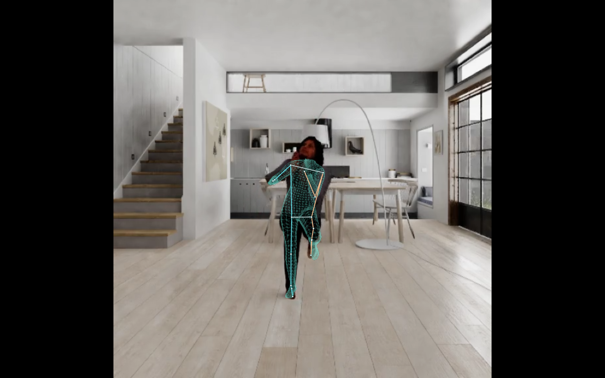

# Проверка экспериментальной поверхности тела

InstantHMR + MHR действительно формирует плотную поверхность в браузере. Коррекция камеры и суставов заметно улучшила её совмещение с изображением на нашем небольшом наборе. **Превосходство над исходным MediaPipe Pose по точности суставов не подтверждено.** Поверхность остаётся экспериментальной; 4899 вершин — детализация предсказанной геометрии, а не 4899 независимо измеренных точек.

## Независимая разметка и результат

Набор: шесть кадров полного тела, два частичных кадра, изолированная кисть и пустой кадр. На восьми положительных кадрах вручную отмечены **44 видимых сустава** с погрешностью разметки и 63 отдельных ориентира внешнего контура одежды. Разметка зафиксирована до просмотра результатов моделей; SHA-256 текущего манифеста совпадает с записью заморозки. Два частичных кадра получены обрезкой уже включённых изображений, поэтому это не восемь независимых сцен. Источники — два публичных видео TensorFlow.js с людьми и публичное видео кисти; личные кадры не использованы.

В таблице — расстояние проекции до ручной точки в пикселях исходного изображения. Все методы сопоставлены с 44/44 точками. «За пределами погрешности» означает `max(0, ошибка − указанная погрешность разметки)`.

| Вариант | Средняя ошибка, px | За пределами погрешности, px | Ошибка / высота видимого человека |
| --- | ---: | ---: | ---: |
| MediaPipe Pose Full, исходные 2D-точки | 8,96 | 2,80 | 0,0220 |
| InstantHMR, отдельная прямая 2D-голова модели | 9,52 | 3,69 | 0,0230 |
| Исходная проекция декодированного MHR | 18,01 | 11,09 | 0,0467 |
| MHR: коррекция камеры и ограниченная IK, ручной bbox | 9,66 | 3,23 | 0,0240 |
| MHR: та же коррекция, автоматический bbox по Pose | 10,79 | 4,49 | 0,0291 |

Коррекция использует наблюдения **Pose**, не ручную разметку. Прямая 2D-голова InstantHMR, проекция отдельной 3D-головы и проекция декодированного MHR — разные выходы; их нельзя подменять друг другом. Для сравнения суставов MHR использована официальная приближённая линейная регрессия 127 → 70, а не произвольный выбор ближайшей вершины.

Среднее объединяет разные разрешения, поэтому в JSON сохранены также результаты по кадрам и нормированные ошибки. В частичном `partial-motion` автоматический bbox дал **18,61 px вместо 6,20 px** с ручным bbox: обрезанное тело остаётся заметной слабостью. Измерены все размеченные проекции, включая суставы, полный участок поверхности которых политика отображения может скрывать.

## Наличие человека и частичное тело

На десяти фиксированных кадрах автоматическая политика приняла **8/8 положительных**, отклонила кисть и пустой кадр; два частичных примера приняты как верхняя часть тела. Это проверка конкретных случаев, не оценка общего процента ошибок.

Gate использует явную уверенность Pose, попадание в кадр и связанные цепочки суставов. Полный участок руки требует плечо–локоть–запястье; участок ноги — бедро–колено–голеностоп. Неподтверждённые участки скрываются; без подтверждённого торса участок тела тоже скрывается. Это опора на видимые якоря, а не маска видимости каждого пикселя.

На отдельном сохранённом наборе **36 сложных ложных распознаваний тела внутри кисти** один Pose-gate пропустил **5/36**. Существующая проверка согласованности независимых Hands/Face/Pose перед gate пропустила **0/36**. Поэтому высокая уверенность Pose сама по себе не доказывает присутствие человека. Fusion содержит консервативные эвристики перекрытия и может скрыть настоящее тело, если крупная ладонь закрыла голову и оба плеча.

## Что подтверждают браузерные проверки

Порт декодера сравнен с официальным PyTorch CPU-вычислением на **16 наборах параметров**: максимальное абсолютное расхождение вершин около **8,35 × 10⁻⁷ м**. Это проверяет корректность переноса вычислений, **не точность восстановления настоящего человека**. Скорость отдельного декодера также не равна скорости полного захвата.

Дополнительный прогон обработал **60 выбранных кадров** двух публичных видео через автоматический bbox и коррекцию; все 60 приняты, 58 как полное тело и 2 как верхняя часть. Кадры последовательно подавались как отдельные изображения. Это **не непрерывный live FPS**, не измерение задержки камера → экран и не проверка временной стабильности на каждом исходном кадре. В отчёте этого прогона записаны отсутствие обращений к камере и закрытие браузера/тестового сервера.

**Интеграция в основное приложение:** после исправления загрузки ресурса ONNX Runtime полный прогон публичных видео через Pose, Face, Hands, fusion и MHR прошёл. На `body-motion.mp4` поверхность показана на **59/59 обработанных кадрах**, на `body-squats.mp4` — **64/64**; у исходного ролика приседаний частота 5 кадров/с. На `hand-signs.mp4` обработано **319 кадров, поверхность тела не показана ни разу**. Ошибок страницы и обращений к камере — 0; отчёт подтверждает остановку сессии, закрытие браузера и тестового сервера. Это воспроизведение видео через интегрированный код, **не тест live-камеры**; 59 обработанных кадров не означают обработку каждого кадра исходного 30 fps ролика.

Обычный режим без поверхности отдельно прошёл **17/17 браузерных регрессионных проверок**. В репозиторий включена только компактная сводка статусов, без личных кадров и координат. Текущий набор unit-тестов: **118 пройдено**. Окончательно собранный preview отдельно обработал `body-motion.mp4`: **53/53 обработанных кадров с поверхностью**, проверка **отмены во время загрузки моделей пройдена**. В этом отчёте также 0 ошибок страницы, 0 обращений к камере и подтверждённое закрытие сессии, браузера и сервера. Разное число обработанных кадров в двух прогонах отражает реальную пропускную способность, а не разные исходные видео.

Кадр из интегрированного видео-прогона. Сетка показывает предсказанную анатомическую поверхность; совпадение контура одежды и скрытая глубина не являются подтверждённой точностью.

## Обновление 29.09: асинхронная сетка и включение по полному телу

Раньше каждый кадр ждал сеть и подгонку поверхности, поэтому весь захват (и скелет) падал с 30 до ~13 кадров/с, файлы сетки (~115 МБ) загружались до запуска камеры, а участки сетки включались и гасли покадрово (порог видимости и порог ошибки проекции без памяти между кадрами). Теперь:

- сеть InstantHMR работает в отдельном воркере по кропу 224×224, не чаще раза в 66 мс и не больше половины времени GPU; второй воркер на каждом кадре подгоняет rig MHR к сглаженным точкам Pose (warm start с предыдущего кадра, 1€-фильтр предсказаний сети, как в upstream-демо); кадр ждёт свою подгонку не дольше 24 мс;
- у графа фиксирована размерность batch = 1 (`freeDimensionOverrides`): shape-подграфы сворачиваются, 74 узла больше не уходят на CPU и исчезают 8 копирований GPU↔CPU; сеть на M1 Pro — 31 мс вместо 36 мс (без MediaPipe рядом);
- bbox для кропа строится как у детектора (до макушки и силуэта), а не с полем 12 %: так обучалась сеть (1,2× квадрат вокруг плотного bbox человека);
- сетка включается, когда 150 мс видно полное тело или верх тела (плечи + таз или плечи + локти), и держится через короткие перекрытия (плечи пропали на 0,45 с или тела недостаточно 1,2 с — выключается). У неполного тела всё ниже самого нижнего видимого сустава плавно скрывается, кроме случая, когда тело продолжается за нижний край кадра;
- крупный план (голова и плечи, остальное за нижним краем кадра) включается при найденном лице на месте носа Pose. Для него подгонка камеры опирается ещё на глаза и уши, диапазон глубины расширен с 0,75–1,5× до 0,4–2,5× прогноза сети (на обрезанном крупном плане сеть сильнее всего ошибается в расстоянии), а сегмент руки подгоняется уже по плечу и локтю без кисти. Проверка на клипе OpenFace «голова и плечи»: крупный план распознан на всех кадрах, сетка на плечах и груди;
- решение принимается после межмодельной проверки. Если найденная кисть накрывает оба плеча, верху тела дополнительно нужно лицо Face Landmarker на месте носа Pose. Из 36 записанных ложных «тел внутри ладони» сам гейт без fusion пропускает 5 (4 выглядят полным телом, у одного верха есть и ложное лицо), после fusion — 0 (`tests/dense-gate.test.js`).

Проверка в Chrome на M1 Pro, виртуальная камера 1280×720 из публичных роликов (включая затемнение, шум, стопы у края кадра, заход/выход из кадра и перекрывающую ноги полосу): захват 29–30 кадров/с вместо 12–13, сетка на всех кадрах после включения, без миганий (одно включение на ролик; при заходе/выходе — по одному переключению на проход). Верх тела: при ногах, обрезанных краем кадра, сетка на 248 из 251 кадра; за «столом» (тёмный прямоугольник закрывает всё ниже пояса) торс и руки видны, у края стола сетка гаснет, поверх стола ноги не рисуются. Средняя ошибка подгонки к точкам Pose (не к ручной разметке): медиана 1,7 % высоты тела против 2,1 % раньше. Полный прогон `npm run test:dense`: `body-motion.mp4` — обработаны все 120 кадров (было 59), сетка на 114–115; `body-squats.mp4` — 61 из 64; `hand-signs.mp4` — 0; тот же ролик приседаний, увеличенный так, что ноги за нижним краем кадра, — сетка на 148 из 152 кадров. То же на собранном `dist/` с разрезанными файлами. Это по-прежнему проверки на видео, не на живой камере.

## Ограничения

Нет плотной эталонной поверхности, 3D ground truth, контрольной съёмки несколькими камерами или независимой разметки скрытых суставов. Контур одежды отличается от анатомии под ней. Вращение из плоскости камеры, перекрытия, спина, частично обрезанное тело и несколько людей остаются неоднозначными и не покрыты достаточным набором испытаний. Сглаживание и число вершин не устраняют эту неоднозначность. Эти результаты позволяют оценить совмещение видимых 2D-якорей на малом наборе, но не заявлять точный 3D-скан или улучшение всех движений.

## Файлы доказательств

Все небольшие отчёты включены в репозиторий; большие веса, исходные тензоры и личные изображения сюда не копировались.

- [Манифест кадров и ручные координаты](evidence/dense/fixture-manifest.json), [фиксация разметки](evidence/dense/annotation-freeze.json).
- [Независимое сравнение после коррекции](evidence/dense/independent-comparison.json), [исходные результаты до коррекции](evidence/dense/raw-comparison.json). В первом сохранены SHA-256 исходных больших JSON; сами большие JSON в этот компактный набор не входят.
- [Проверка gate и 36 сложных случаев](evidence/dense/body-gate-audit.json).
- [Проверка браузерного декодера](evidence/dense/decoder-browser-report.json).
- [Автоматические десять кадров](evidence/dense/automatic-runtime-report.json), [60 выбранных видеокадров](evidence/dense/sampled-video-report.json).
- [Полный видео-прогон интегрированного режима](evidence/dense/production-video-report.json), [собранный preview и отмена загрузки](evidence/dense/built-preview-report.json), [публичный кадр результата](evidence/dense/production-motion.png), [17 регрессий обычного режима — компактная сводка](evidence/dense/default-regression-summary.json).
- [Размеры, происхождение и SHA-256 копий](evidence/dense/bundle-manifest.json).
